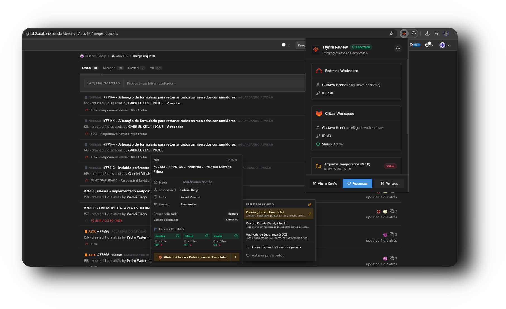
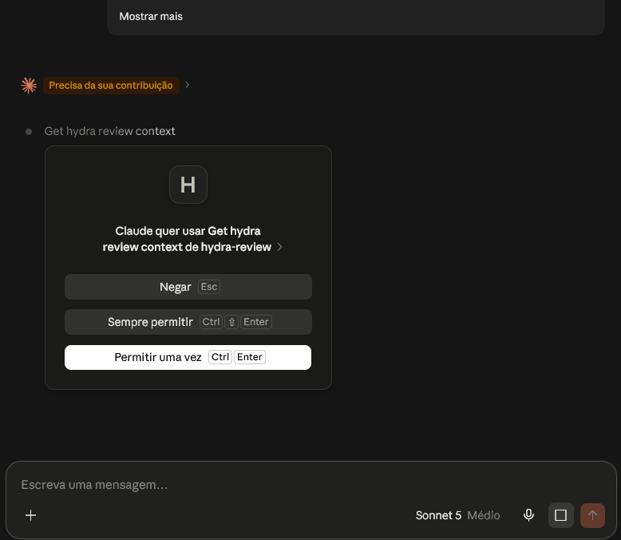

<h2 align="center">
  <div align="center">
    
  </div>

Hydra Review

</h2>

<p align="center">
  
  
  
  
</p>

<p align="center"></p>

---

## 🎯 O que é o Hydra Review?

O **Hydra Review** é uma extensão Chrome criada para acelerar a rotina de desenvolvimento e code review no GitLab. Ela conecta automaticamente os Merge Requests (MRs) às tarefas do Redmine e disponibiliza visibilidade imediata das branches e diffs sem fricção.

## 🚀 Principais Recursos

- **Vínculo Automático com Redmine:** Detecta IDs de tarefas em títulos ou branches de MRs (`#12345`, `feature/12345`) e exibe status, prioridade, autor e revisores em hover cards elegantes.
- **Rastreador de Branches & Diffs:** Exibe o status de cada branch de destino (`develop`, `release`, `master`) com badges diretos e métricas exatas de alterações (`X files`, `+Y -Z`) com link direto para a tela de diffs.
- **Isolamento Completo (Shadow DOM):** Interface moderna com Tailwind CSS e Shadcn UI injetada sem interferir nos estilos nativos do GitLab.
- **Suporte a Dark & Light Mode:** Cores e tipografia adaptadas harmonicamente ao tema do GitLab e da extensão.
- **Dashboard de Conexão Rápida:** Popup intuitivo para testar credenciais, reconectar serviços e inspecionar logs de execução em tempo real.

## 📦 Instalação

1. Baixe o pacote `.zip` da versão mais recente na aba de [Releases](https://github.com/Gustavohps10/hydra-review/releases).
2. Extraia o conteúdo em uma pasta no seu computador.
3. No Google Chrome, acesse `chrome://extensions/`.
4. Ative a chave **"Modo do desenvolvedor"** no canto superior direito.
5. Clique em **"Carregar sem compactação"** e selecione a pasta descompactada.
6. Abra o popup da extensão para configurar as URLs e tokens de acesso do GitLab e Redmine.

## 🤖 Configuração do Servidor MCP (Claude Desktop)

O **Hydra Review MCP Server** (`hydra-review-mcp.exe`) atua como bridge local entre a extensão do Chrome e o Claude Desktop, permitindo sincronizar requisitos do Redmine e diffs consolidados de todos os repositórios (Frontend, Backend, ERP) direto no Claude Desktop.

### 1. Download do Executável
1. Acesse a aba de [Releases](https://github.com/Gustavohps10/hydra-review/releases) e baixe o `hydra-review-mcp.exe`.
2. Mova o executável para uma pasta definitiva no seu computador (ex: `C:\tools\hydra-review-mcp.exe` ou `C:\Users\SEU_USUARIO\.hydra-review\hydra-review-mcp.exe`).
   > **Nota sobre o aviso do Windows SmartScreen:** Por se tratar de um utilitário interno sem certificado comercial corporativo, o Windows pode exibir *"O Windows protegeu o computador"*. Basta clicar em **"Mais informações"** ➔ **"Executar assim mesmo"** (ou abrir as *Propriedades* do arquivo e marcar **"Desbloquear"**).

### 2. Adicionar ao Claude Desktop
1. No **Claude Desktop**, abra as configurações:
   - Menu **Claude** (canto superior esquerdo) ➔ **Settings...** (ou atalho `Ctrl + ,`).
2. Acesse a aba **Developer** e clique em **Edit Config** para abrir o arquivo `claude_desktop_config.json`.
3. Adicione o servidor `hydra-review` dentro da chave `mcpServers`:

```json
{
  "mcpServers": {
    "hydra-review": {
      "command": "C:\\caminho\\completo\\para\\hydra-review-mcp.exe"
    }
  }
}
```
*(Importante: no Windows, utilize barras duplas `\\` para separar os diretórios e evite diretórios especiais como Downloads ou System32, dando preferência a pastas sem restrições de permissão como `C:\\tools\\` ou `C:\\Users\\SEU_USUARIO\\.hydra-review\\`).*

4. Salve o arquivo e feche o editor.

### 3. Reiniciar o Claude Desktop por Completo ⚠️
O Claude Desktop **não** carrega novos servidores MCP se apenas fechar e reabrir a janela simples:
1. Feche a janela principal do Claude Desktop.
2. Vá até a **Bandeja do Sistema** (perto do relógio do Windows, na barra de tarefas inferior direita).
3. Clique com o botão direito no ícone do Claude e selecione **"Quit Claude"** (ou encerre o processo `Claude.exe` pelo Gerenciador de Tarefas).
4. Abra o Claude Desktop novamente.
5. Ao iniciar, verifique se o ícone de ferramentas (martelo) aparece no canto inferior da área de mensagens indicando que o servidor `hydra-review` está ativo e conectado!

### 4. Abrindo o Code Review no Claude Desktop
1. No GitLab, passe o mouse sobre o badge da tarefa para abrir o popover do Hydra Review e clique no botão **"Abrir no Claude"** (ou escolha um preset no menu lateral).
2. A extensão sincronizará os dados instantaneamente com a bridge local e abrirá o Claude Desktop pronto para o review.
3. Na primeira execução de cada tarefa, o Claude solicitará permissão para executar a ferramenta `Get hydra review context`:
   - Selecione **"Sempre permitir"** para autorizar a leitura dos arquivos de contexto de forma contínua e sem interrupções.

<p align="center">
  
</p>

4. Pronto! O Claude carregará automaticamente todo o histórico e requisitos do Redmine juntamente com os diffs unificados de todos os repositórios vinculados (Frontend, Backend, etc.), iniciando o code review de forma aprofundada!

## 🛠️ Desenvolvimento Local

```bash
# Instalar dependências
npm install

# Modo desenvolvimento (com hot-reload)
npm run dev

# Gerar build de produção
npm run build

# Gerar pacote zip para distribuição
npm run zip
```

## 🤝 Contribuição & Roadmap Aberto

Consulte o documento oficial [GITFLOW.md](./GITFLOW.md) para entender a política de branches, uso do `changeset` para versionamento e como funciona o fluxo de Pull Requests e releases automáticas do projeto.

### 💡 No que você pode contribuir?

Buscamos contribuições para tornar o Hydra Review uma ferramenta cada vez mais agnóstica, flexível e adaptável a diferentes realidades corporativas. Pontos prioritários e desafios arquiteturais a melhorar:

- **🎨 Melhorias Visuais e de UX:**
  - Refinamentos no design system (Tailwind CSS + Shadcn UI).
  - Microinterações, tooltips explicativos e melhoria nos estados de carregamento (skeletons e spinners).
  - Acessibilidade e suporte aprimorado a temas de alto contraste.

- **🧩 Desacoplamento do Redmine (Campos Customizados Flexíveis):**
  - *Desafio Atual:* O addon foi construído com base em instâncias Redmine 3.4.x, utilizando heurísticas e IDs fixos de campos customizados (ex: `id: 52`, `id: 66` para *Branch Solicitada* e *Versão*, `id: 9` para *Responsável Revisão*). Em outras empresas e instâncias, esses IDs e nomenclaturas variam completamente.
  - *Oportunidade:* Criar uma interface no popup de **Mapeamento Dinâmico de Campos** (Field Mapping), permitindo que cada usuário associe os campos do seu Redmine às informações exibidas no popover e nos prompts do Claude.

- **🌐 Compatibilidade entre Versões do GitLab:**
  - *Desafio Atual:* O addon foi modelado principalmente sobre a estrutura do GitLab 14.0.1 on-premise.
  - *Oportunidade:* Validar e adaptar seletores de injeção no DOM, eventos de navegação SPA (Turbo/Turbolinks) e rotas de diff para versões mais recentes do GitLab (15.x, 16.x, 17.x) e GitLab.com (SaaS).

- **🔀 Flexibilidade de Fluxos Git (Além do GitFlow Tradicional):**
  - *Desafio Atual:* A validação de branches foca na tríade `develop`, `release` e `master`.
  - *Oportunidade:* Tornar configurável a lista de branches monitoradas (ex: permitir workflows com `main`, `staging`, `production`, `trunk-based`).

- **🌍 Internacionalização (i18n) e Status Configuráveis:**
  - *Desafio Atual:* Interface e heurísticas de leitura de status voltadas ao português.
  - *Oportunidade:* Adicionar suporte a múltiplos idiomas (EN/ES/PT) e permitir mapear equivalências de status de tarefas (ex: "Em Andamento", "In Progress", "Code Review").

- **🔌 Arquitetura Modular de Trackers (Adaptadores de Provedor):**
  - Desacoplar a camada de API em contratos universais (`IssueTrackerAdapter`), facilitando a inclusão futura de outros gerenciadores de tarefas além do Redmine (como Jira, YouTrack e Azure Boards).

- **🤖 Suporte Multi-IA & Clientes Agnósticos:**
  - *Desafio Atual:* O fluxo direto foi desenhado inicialmente focado no ecossistema do Claude Desktop (deep linking `claude://` e ações rotuladas para o Claude).
  - *Oportunidade:* Como o servidor Hydra Review é baseado no protocolo aberto MCP (Model Context Protocol), podemos expandir a integração direta para outros clientes e IDEs com suporte a MCP ou prompts externos — como **Cursor**, **Windsurf**, **ChatGPT (Desktop/Web)**, extensões do **VS Code** ou modelos locais via **Ollama**. Isso inclui permitir que o usuário configure seu assistente de IA preferido diretamente no popup.

## :adult: Autores

<!-- ALL-CONTRIBUTORS-LIST:START - Do not remove or modify this section -->
<!-- prettier-ignore-start -->
<!-- markdownlint-disable -->
<table>
  <tbody>
    <tr>
      <td align="center" valign="top" width="14.28%"><a href="https://gustavohenrique.vercel.app/"><br /><sub><b>Gustavo Henrique</b></sub></a><br /><a href="#code-Gustavohps10" title="Code">💻</a></td>
    </tr>
  </tbody>
</table>

<!-- markdownlint-restore -->
<!-- prettier-ignore-end -->

<!-- ALL-CONTRIBUTORS-LIST:END -->
